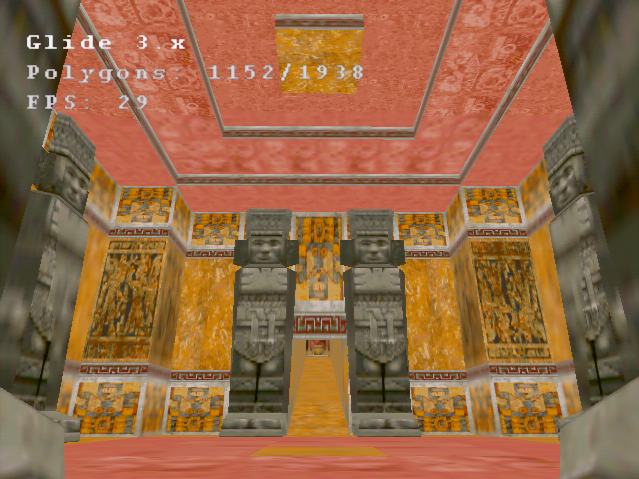
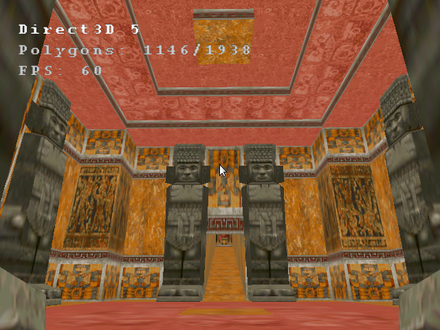

# Kelpo

More info to come.

# Developer's manual

## Examples

You can find small, contained samples of Kelpo in use under the [examples/](./examples/) directory.

It may be best to start by looking at the `simple_triangle` example. It does nothing but render a single static triangle, and so strips away everything except the bare essentials needed to incorporate Kelpo into an application.

## Code organization

You can find the full source code to Kelpo in the [src/](./src/) directory.

The Kelpo codebase is split into three categories:

1. Renderer ([src/kelpo_renderer/](./src/kelpo_renderer/))
2. Interface ([src/kelpo_interface/](./src/kelpo_interface/))
3. Auxiliary ([src/kelpo_auxiliary/](./src/kelpo_auxiliary/))

### Renderer

Renderer code is found under [src/kelpo_renderer/](./src/kelpo_renderer/).

A renderer represents a 3D API wrapped by Kelpo; e.g. Direct3D 7. It includes rasterizing and window management functionality using that API, and compiles into a standalone DLL library to be bundled with a client application (an application that uses Kelpo).

All Kelpo renderers provide the function `export_interface()`, defined in the corresponding `renderer_xxxx.c` source file found under [src/kelpo_renderer/](./src/kelpo_renderer/), which exports the renderer's code into a client application (see [interface](#interface)).

Client applications don't include renderer code directly, only the compiled renderer libraries (see [interface](#interface))..

Exposed functions in renderer code use the `kelpo_` prefix.

#### Sub-categories

Renderer code is further split into three sub-categories:

1. Rasterizer
2. Window
3. Surface

Rasterizer code is responsible for rendering polygons using rasterizing functionality provided by the API (e.g. OpenGL 1.2). Exposed functions in rasterizer code use the `kelpo_rasterizer_xxxx__` prefix, where "xxxx" is the API's name (e.g. "opengl_1_2").

Window code provides the means to create and manage a Win32 window in which rasterized images can be displayed to the user. Exposed functions in window code use the `kelpo_window__` prefix.

Surface code mediates between the rasterizer and the window, providing the rasterizer a surface to render into and inserting the surface into the window for display. (Some renderers rely on a combination of surfaces: for instance, the Direct3D 5 API requires by its design both a Direct3D and a DirectDraw surface.) Exposed functions in surface code use the `kelpo_surface_xxxx__` prefix, where "xxxx" is the API's name (e.g. "glide_3").

### Interface

Interface code is found under [src/kelpo_interface/](./src/kelpo_interface/).

Client applications include and use the interface code to interact with Kelpo's renderer libraries.

Interface code provides the `kelpo_interface_s` struct populated via `kelpo_create_interface()` with functions that allow a client application to operate a given Kelpo renderer.

Exposed functions in interface code use the `kelpo_` prefix.

### Auxiliary

Auxiliary code is found under [src/kelpo_auxiliary/](./src/kelpo_auxiliary/).

Auxiliary code provides Kelpo-compatible implementations of various rendering-related tasks, e.g. triangle transformation. Client applications can optionally include some or all of this functionality to avoid having to implement it themselves.

Kelpo's auxiliary code is neither required by Kelpo to operate nor guaranteed to be best-case implementations. You can use it as a time saver or a starting point (minding any licensing restrictions), or choose to bring your own - it's up to you.

Exposed functions in auxiliary code use the `kelpoa_` prefix.

## Error handling

Every function exposed by the `kelpo_interface_s` struct, as well as all internal Kelpo functions prefixed with `kelpo_`, are guaranteed to return either 1 to indicate success or 0 to indicate failure.

Every such function that returns 0 will also push an error code into Kelpo's error queue, further describing the error. To retrieve these error codes, use the `kelpo_error_code()` and `kelpo_error_peek()` functions.

To retrieve the most recent error code and remove it from the error queue, call `kelpo_error_code()`. Calling this function in a loop until it returns `KELPOERR_NO_ERROR` will return and remove all errors in the queue, with `KELPOERR_NO_ERROR` indicating that the queue is empty.

To retrieve the most recent error code without modifying the error queue, call `kelpo_error_peek()`. Since this function doesn't modify the queue, it can only return the most recent error, or `KELPOERR_NO_ERROR` to indicate that the queue is empty.

To find whether Kelpo has reported any errors, you can use e.g. `(kelpo_error_peek() == KELPOERR_NO_ERROR)`. It evaluates to true when there are no errors and false otherwise, without modifying the error queue.

The error queue can be reset (cleared) by calling `kelpo_error_reset()`. All accumulated error codes will be removed, and both `kelpo_error_code()` and `kelpo_error_peek()` will return `KELPOERR_NO_ERROR` until further errors are reported.

# Screenshots

\
**Scene:** Tomb Raider 1, level 4\
**Kelpo version:** alpha\
**Renderer:** Glide 3\
**GPU:** 3dfx Voodoo\
**CPU:** AMD K6 300\
**OS:** Windows 98

\
**Scene:** Tomb Raider 1, level 4\
**Kelpo version:** alpha\
**Renderer:** Direct3D 5\
**GPU:** GeForce GTX 980\
**OS:** Wine/Linux
